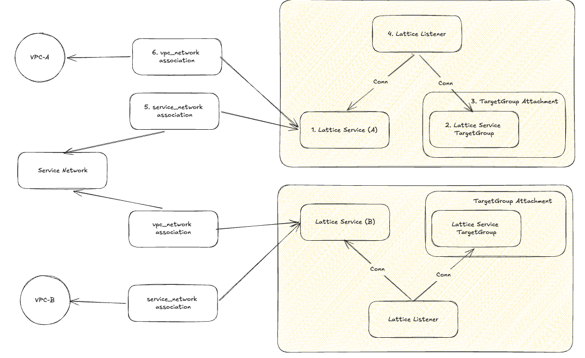

# Lattice Test



## 테스트 목표

- VPC-A 에 EC2 띄우고
- VPC-B 에 EC2 띄우고
- A ↔ B 끼리 통신이 가능한지 여부 확인
- **이때 uncloud를 사용했는데 init 한 cluster에  나머지 vpc 구성에 띄운 ec2를 add 하는형태로 해야 함 → 이때 두 통신이 wireguard 통신이 열려있어야 함**


## TGW / Peering 과 차이점

- TGW / Peering 은 대역을 열어주는거니까, 세부적인 설정이 어려움
- TGW Attachment도 계속 만들어주면 엄청 골치 아픔
- Centralziase 설정에도 VPC Lattice를 구성하면 좀더 효율적으로 가능할 듯

## Lattice ...

- None / AWS IAM
    - None 은 기존 HTTP 요청으로 진행
    - **AWS IAM 은 Sigv4 요청으로 진행함 (운영환경은 이걸로 최대한 진행)**
- Lattice Target Group (서비스와 1:1)
    - 이때 Lattice는 TargetGroup을 기반으로  트래픽을 어디로 보낼지 지정하는 용도로 구성 (**vpc lattice 용 target group 이 있음**)

## 각 도메인별로 통신확인

```sh
input_svc_dns = tolist([
  {
    "domain_name" = "input-svc-0e20fcab0977376c3.7d67968.vpc-lattice-svcs.ap-northeast-2.on.aws"
    "hosted_zone_id" = "Z04595802HTZ0Z5UOTYYK"
  },
])
output_svc_dns = tolist([
  {
    "domain_name" = "output-svc-0f36f438f8218bf4f.7d67968.vpc-lattice-svcs.ap-northeast-2.on.aws"
    "hosted_zone_id" = "Z04595802HTZ0Z5UOTYYK"
  },
])
```
